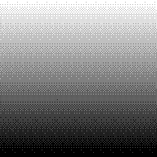

This repository provides source code to quantize and dither a image using the Bayer matrix.
The code supports both greyscale and RGB images.

### Usage

Compile the code and run it by specifying the number of colors you want per channel, and the path to the image.
For example, the following command load the image `example/ramp.png` and quantifies it using 3 colors 
```sh
./dither 3 example/ramp.png
```
Here is the input and output for this particular example: 




Note that the program will systematically export the dithered result to the .BMP file  `output.bmp`.

### License

The code from this repository is released in public domain. You can do anything you want with them. You have no legal obligation to do anything else, although I appreciate attribution.

It is also licensed under the MIT open source license, if you have lawyers who are unhappy with public domain.
